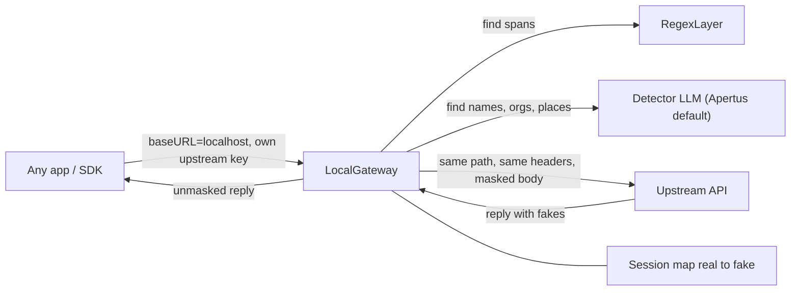

# Apertus privacy gateway

## Goal

This is one local process. A user starts it with one command and changes only the base URL in their app. The app keeps sending its own upstream key: OpenAI, Anthropic, an OpenAI-compatible host, or a local model. The gateway knows nothing about providers. It forwards the request as it arrived, except that personal data in the JSON body is swapped for fakes on the way out and swapped back in the reply.

The detector is any OpenAI-compatible chat model. Apertus, the public Swiss model, is the default. The user can point the detector at a local Ollama model, at Apertus, or at any other endpoint they trust. The detector is the only model that sees real text. The upstream only ever sees fakes.



## Decisions already made

- **Agnostic forwarding.** The gateway forwards any path. It is not limited to `/v1/chat/completions`. It masks every JSON body with one generic walker, so Anthropic `/v1/messages`, embeddings, and the Responses API work with no per-provider handler. Bodies that are not JSON are refused by default, because they cannot be masked.
- **The detector is any LLM.** Config uses `DETECTOR_*` variables. Apertus is only a preset. `--detection regex` runs with no detector model.
- **One-command start.** The server uses `node:http`, so `npx apertus-privacy-gateway` works on plain Node 20+. Tests run with `bun test`.
- **Auth is transparent.** Every auth header is forwarded unchanged (`Authorization`, `x-api-key`, `api-key`, `anthropic-version`). The proxy holds only the detector key. The app keeps its own upstream key.
- **Own code.** The mask, map, and fake-value code is ours. The `pii-proxy` package is not a dependency. No runtime dependencies: `fetch` and `node:http` are built in.

## Repo layout

```
src/
  cli.ts             parse flags + env, start server, print quick-start hint
  config.ts          config type + defaults (Apertus preset)   DONE
  server.ts          node:http server, routing, request/response piping
  proxy/
    forward.ts       build upstream URL, copy headers, stream body back
    headers.ts       hop-by-hop strip, gateway headers removed before upstream
  detect/
    types.ts         Detection { type, value, start, end, source }
    regex.ts         pattern detectors
    llm.ts           OpenAI-compatible detector (any model, JSON spans)
    pipeline.ts      run layers, merge overlaps, cache
  mask/
    map.ts           bijective SessionMap
    generators.ts    fake value per entity type
    walk.ts          generic JSON walker + structural-key skip list
    mask.ts          maskText, maskJson
    unmask.ts        unmaskText, unmaskJson
    stream.ts        SSE unmasker with holdback on known delta fields
  session/store.ts   in-memory sessions with TTL
tests/
examples/            curl, OpenAI SDK, Anthropic SDK, inspect demo
```

Already on disk: `package.json`, `tsconfig.json`, `LICENSE`, `.gitignore`, `.env.example`, `src/config.ts`.

## Quick start

```bash
DETECTOR_API_KEY=... npx apertus-privacy-gateway --upstream https://api.openai.com/v1
```

The only change in the app:

```bash
OPENAI_BASE_URL=http://localhost:8787/v1   # key stays the user's own OPENAI_API_KEY
```

For Anthropic, use `--upstream https://api.anthropic.com` with `ANTHROPIC_BASE_URL=http://localhost:8787`.

## Configuration

- `--upstream` / `UPSTREAM_BASE_URL`: the default target, for example `https://api.openai.com/v1`.
- `--allow-upstream-override` / `ALLOW_UPSTREAM_OVERRIDE=false`: if this is on, a request can choose its upstream with `X-Upstream-Base-URL`. That header is checked against `UPSTREAM_ALLOWLIST`.
- Detector:
  - `DETECTOR_BASE_URL`, default `https://api.swisscom.com/products/swiss-ai-weeks/apertus-1.5-70b/v1`.
  - `DETECTOR_MODEL`, default `swiss-ai/Apertus-v1.5-70B`.
  - `DETECTOR_API_KEY`.
  - Any OpenAI-compatible endpoint works. Example: `DETECTOR_BASE_URL=http://localhost:11434/v1 DETECTOR_MODEL=qwen3:1.7b`.
- `--detection llm+regex|regex`.
- `ON_DETECTOR_ERROR=block|regex`. Default `block` returns 502 and never forwards unmasked text.
- `--port 8787`, `SESSION_TTL_SECONDS=3600`.
- `--allow-raw` / `ALLOW_RAW_BODIES=false`.
- Listen address `127.0.0.1`. `--host 0.0.0.0` is opt-in and prints a warning.

## HTTP behaviour

- Any method and any path is forwarded to `upstream + path + query`.
- Join rule: if the request path already starts with the upstream base path (both end in `/v1`), use `origin + request path` so `/v1` is not doubled.
- JSON bodies (`content-type: application/json`) are masked, then forwarded.
- Requests without a body (GET, DELETE) are forwarded unchanged.
- Bodies that are not JSON get `415`, unless `--allow-raw` is on.
- Headers copied except hop-by-hop, `host`, `content-length` (recomputed), `accept-encoding` (forced to `identity`), and `X-Pii-*` / `X-Upstream-*`. Auth headers are never logged.
- Optional `X-Pii-Session` keeps the same fakes across requests. Without it, each request gets a fresh map.
- JSON responses are unmasked with `unmaskJson`. `text/event-stream` goes through the stream unmasker. Other text goes through `unmaskText`. Binary replies pass through.
- Audit headers: `X-Pii-Masked: <count>` and `X-Pii-Types: email,person_name`. Counts and types only, never values.
- `GET /_gateway/health` is answered locally. It reports whether the detector and the upstream are reachable.

## Generic JSON walker

- Visit every string leaf. Object keys are never masked.
- Skip structural values by key name: `model`, `role`, `type`, `id`, keys ending in `_id`, `object`, `stop`, `tool_choice`, `response_format`, `format`, `encoding_format`, `anthropic_version`, `mime_type`, `media_type`, `url` when it is a `data:` URI, and base64 blobs longer than 1 KB.
- Skip whole subtrees: `tools`, `functions`, `input_schema`, `parameters`, `json_schema`.
- A string that parses as a JSON object or array (OpenAI tool-call `arguments`) is walked recursively and serialized again.
- All maskable strings from one request go to the detector as one batch, one detection call per chunk group.

## Detection

Regex runs first and wins ties with the LLM layer.

- Email, phone (international and Swiss `+41` or `0xx`), IPv4 and IPv6, URLs that contain a query or a personal path, UUIDs.
- Credit card, checked with Luhn.
- IBAN, checked with mod-97.
- AHV/AVS `756.XXXX.XXXX.XX`, checked with its EAN-13 check digit.
- Dates only when they sit next to words such as "born", "geboren", "né", "DOB".

LLM layer (`detect/llm.ts`), any OpenAI-compatible model:

- `POST ${DETECTOR_BASE_URL}/chat/completions`, `temperature: 0`.
- System prompt asks for JSON only: `{"entities":[{"type":"person_name","value":"Marcus Weber"}]}`.
- Types: `person_name`, `organization`, `location`, `address`, `date_of_birth`, `medical_record`, `insurance_id`, `other_id`.
- Prompt is multilingual: DE, FR, IT, EN, Swiss German.
- Send `response_format: {type: "json_object"}` only if the endpoint accepts it. After one 400, retry without that field and remember the result for the endpoint.
- Do not trust model offsets. Locate every returned `value` verbatim. Discard values that do not appear.
- Split inputs longer than about 6k characters at paragraph boundaries. Detect chunks in parallel.
- Strip the reply to the first JSON object. Retry once on parse failure. A second failure follows `ON_DETECTOR_ERROR`.
- Timeout 15 seconds.

Pipeline:

- Regex and LLM run in parallel.
- On overlap: regex wins, then the longer span wins.
- LRU cache keyed by `sha256(detectorModel + text)`.

## Masking

`SessionMap`:

- Two maps, `real -> fake` and `fake -> real`, keyed by `type + normalized value` (emails lowercased).
- Bijective. Reject a fake and generate again if it is already mapped, if it equals any real value, or if it appears in the current request.
- Never log map entries.

Generators, seeded by session id + real value + attempt:

- Names from built-in Swiss and international lists. Keep token count and capitalization.
- Organizations, cities, and addresses from built-in lists.
- Format-preserving fakes: digit to digit, letter to letter, separators kept.
- Credit cards, IBANs, and AHV numbers get their check digit recomputed.
- Email: fake local part at a fake domain. IPs: same address family. URLs: host kept, personal path or query replaced.

Unmask:

- One regex of all fakes, escaped, longest first.
- Exact match, plus ALL CAPS and lowercase variants of names.
- `unmaskJson` walks every string leaf, including JSON-in-string tool arguments.

## Streaming

Parse server-sent events line by line. Parse each `data:` payload as JSON when possible.

Holdback buffer, one per stream position, because a fake can be split across chunks:

- OpenAI chat: `choices[i].delta.content` and `choices[i].delta.tool_calls[j].function.arguments`.
- OpenAI Responses: `delta` on `response.output_text.delta`.
- Anthropic: `delta.text` and `delta.partial_json` per `index`.

After each delta, emit the longest prefix that cannot be the start of any fake. Hold the rest, at most `maxFakeLength - 1` characters. Flush on `finish_reason`, `content_block_stop`, `message_stop`, `[DONE]`, and when the stream ends.

All other string fields in an event are unmasked per event, with no holdback. Ids, event names, usage, and unknown fields stay untouched. An empty delta is still emitted as an empty delta.

## Error handling

- Detector fails or times out: `ON_DETECTOR_ERROR`. Default is 502 `{"error":{"type":"pii_detection_failed"}}`. Nothing is forwarded.
- Upstream 4xx or 5xx: pass the status through and unmask the body.
- Malformed client JSON: 400. Never forwarded raw.
- Logs: request id, method, path, entity counts and types, latency, upstream status. Never bodies, keys, or map entries.

## Security notes for the README

- The map is personal data. It lives only in memory, with a TTL, and is dropped when the process exits.
- Only the detector model sees real text. That can be Apertus, a local model, or any endpoint the user trusts.
- Detection is not guaranteed. The upstream reasons about the fakes. Invented personal data in the reply is not reversed. Images, audio, and raw bodies are not masked.

## Tests (`bun test`)

- Map: bijectivity, collision retries, deterministic seeding.
- Generators: format kept, Luhn / IBAN / AHV still valid, fake never equals the real value.
- Walker: structural keys skipped, tool schemas untouched, JSON-in-string walked. Round trip `unmaskJson(maskJson(x))` on OpenAI, Anthropic, and Responses fixtures.
- Regex unit tests. LLM detector against a stub: hallucinated values, malformed JSON, and a 400 on `response_format`.
- Streaming: a fake split at every character boundary for OpenAI content, OpenAI tool arguments, and Anthropic `text_delta` and `input_json_delta`.
- Integration: mock upstream never sees real fixture values; `Authorization` and `x-api-key` arrive unchanged; client gets real values back, streamed and not, for OpenAI and Anthropic shapes. A second stub proves `DETECTOR_BASE_URL` is what the gateway calls.
- `scripts/smoke.ts`: real detector (Apertus or Ollama) plus the mock upstream.

## Demo

- `examples/curl.sh`
- `examples/openai-sdk.ts` with `baseURL: "http://localhost:8787/v1"`
- `examples/anthropic-sdk.ts` with `baseURL: "http://localhost:8787"`
- `npx apertus-privacy-gateway --inspect`: built-in mock upstream prints exactly what it received.
- README: pitch, one-line quick start, detector presets (Apertus, Ollama, custom), security model, limitations.

## Out of scope for v1

- Masking inside images and audio.
- A persistent map backend.
- A UI beyond `--inspect`.
- Hosted multi-tenant deployment.

## Next steps

Work in this order. Do not edit the Cursor plan file.

1. **Map and generators.** `src/mask/rng.ts`, `src/mask/map.ts`, `src/mask/generators.ts`. Seeded bijective `SessionMap`. Format-preserving fakes with valid Luhn, IBAN mod-97, and AHV EAN-13. Tests in `tests/map.test.ts` and `tests/generators.test.ts`.
2. **Regex detection.** `src/detect/types.ts`, `src/detect/regex.ts`. Email, phone, IP, URL, UUID, credit card, IBAN, AHV, contextual dates. Tests in `tests/regex.test.ts`.
3. **LLM detector and pipeline.** `src/detect/llm.ts`, `src/detect/pipeline.ts`. Batch texts, chunk at about 6k, locate values verbatim, retry once, drop `response_format` after a 400, LRU cache, regex-wins merge. Tests against a stub HTTP endpoint.
4. **Walker, mask, unmask.** `src/mask/walk.ts`, `src/mask/mask.ts`, `src/mask/unmask.ts`. Skip structural keys and schema subtrees. Round-trip tests on OpenAI, Anthropic, and Responses fixtures.
5. **Proxy.** `src/proxy/headers.ts`, `src/proxy/forward.ts`, `src/server.ts`, `src/session/store.ts`, `src/cli.ts`. Forward any path, mask JSON, 415 for non-JSON, 400 for malformed JSON, transparent auth, sessions, `/_gateway/health`.
6. **Streaming.** `src/mask/stream.ts`. Holdback on the known delta fields. Split-boundary tests.
7. **Errors and logs.** Fail closed on detector errors, unmask upstream error bodies, audit headers, logs with no bodies or keys.
8. **Integration and smoke.** Mock-upstream tests for both provider shapes, detector-swap test, `scripts/smoke.ts`.
9. **Demo and README.** `examples/curl.sh`, `examples/openai-sdk.ts`, `examples/anthropic-sdk.ts`, `--inspect`, `README.md`.
10. **Verify.** `bun test` and `npx tsc --noEmit` from this folder. Fix failures before calling it done.
