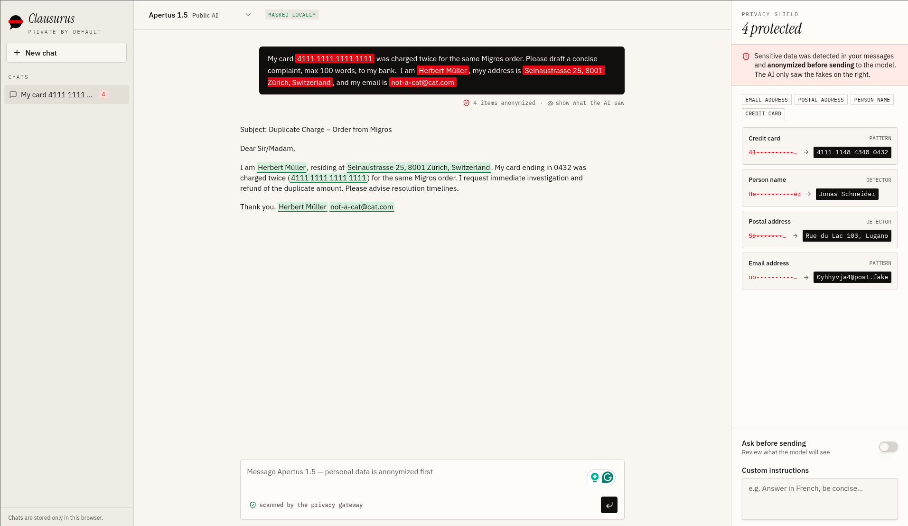

# Clausurus: Privacy Gateway

**Use ChatGPT or Claude without handing them your personal data (PII).**

When you paste a letter into an AI chatbot, everything in it (names, addresses, account numbers) goes to the company running the model. This gateway sits in between. Before your request goes out, it finds the personal details and masks them: each one is replaced with a realistic stand-in, not blacked out. The AI works on the masked version. When the answer comes back, the gateway unmasks it and restores the real details, so the reply reads as if nothing had changed.

```
You write:      "... mein Name ist Martina Brunner-Keller, Lindenstrasse 14, 8739 Seewilen ..."
OpenAI sees:    "... mein Name ist Sabine Meier, Birkenweg 3, 8400 Winterthur ..."
You get back:   a reply addressed to Martina Brunner-Keller
```

*(Illustrative example, fictional data.)*


The only model that ever sees your real text is the **detector**, which finds the personal data. By default that's **Apertus**, Switzerland's fully open public model. You can also run a model on your own computer instead. Either way, the provider you're protecting your data from never does the detecting.

## Example

Here I asked the AI to write a conscie email based on my personal information for a Migros complaint. In red you can see the flagged personal info, and on the right you an see how it was replaced for the AI. In the final response you can see the real information you provided again, as it was placed back in.



## Features

- Use what ever model you want, how you want, while keeping your datasafe.
- Personal information is only shows to sources you trust.
- You keep your own API key; only the base URL changes.
- Works with OpenAI- and Anthropic-style APIs, including streamed replies.
- Personal details are swapped for realistic stand-ins, then restored in the reply.

## Future plan

The same mask-and-restore path for anyone who wants a foreign model on data that should stay here:

- Browser extension to make agentic privacy available for even more people.
- Support of full agentic workflows with masked personal information.
- Privacy safe document and audio transcription

## In one paragraph, for developers

A single local process that proxies OpenAI- and Anthropic-style APIs. Point your app's base URL at `localhost` and keep your own upstream API key. Personal spans in the JSON body are detected (regex + an LLM detector) and masked with format-preserving substitutes from an in-memory session map. The masked request goes upstream with your auth headers unchanged, and the response, including SSE streams, is unmasked on the way back. If detection fails, nothing is forwarded (fail closed by default).

## Quick start

Copy `.env.example` to `.env` and insert your API keys (and any other values you want to change). Then:

```bash
npx clausurs
```

In your app, change only the base URL (key unchanged):

```bash
OPENAI_BASE_URL=http://localhost:8787/v1
```

## Detector presets


| Preset                | Env                                                                                                               |
| --------------------- | ----------------------------------------------------------------------------------------------------------------- |
| **Apertus** (default) | `DETECTOR_BASE_URL` / `DETECTOR_MODEL` default to the Swisscom Apertus endpoint; set `DETECTOR_API_KEY`           |
| **Ollama**            | `DETECTOR_BASE_URL=http://localhost:11434/v1` `DETECTOR_MODEL=qwen3:1.7b`                                         |
| **Custom**            | Any OpenAI-compatible `/v1/chat/completions` host via `DETECTOR_BASE_URL` + `DETECTOR_MODEL` + `DETECTOR_API_KEY` |


Detection mode: `DETECTION=llm+regex` (default) or `regex` in `.env`. On detector failure, `ON_DETECTOR_ERROR=block` (default) returns `502` with `{"error":{"type":"pii_detection_failed"}}` and forwards nothing; set `regex` to fall back to regex-only.

## How it works

1. Your app sends the usual request (path, auth headers, JSON body) to the gateway.
2. Regex (+ optional LLM) finds personal spans; a session map replaces them with format-preserving fakes.
3. The gateway forwards the same path and auth headers to `UPSTREAM_BASE_URL` with the masked body.
4. The reply is unmasked (including SSE streams) so your app sees real values again.

Auth is transparent: `Authorization`, `x-api-key`, `api-key`, and `anthropic-version` are forwarded unchanged and never logged. The gateway only holds the detector key.

## Security model

- The real↔fake **map is personal data**. It lives **only in memory**, with a TTL (`SESSION_TTL_SECONDS`), and is dropped when the process exits. Map entries are never logged.
- **Only the detector** sees real text (Apertus, Ollama, or any endpoint you trust).
- Listen address defaults to `127.0.0.1`. `HOST=0.0.0.0` in `.env` is opt-in and prints a warning.
- Audit headers: `X-Pii-Masked` (count) and `X-Pii-Types` (types only)—never values.
- Non-JSON bodies: `415` unless `--allow-raw`. Malformed JSON: `400`, never forwarded raw.


## Develop

```bash
bun test
npx tsc --noEmit
bun src/cli.ts
```

Examples: `examples/curl.sh`, `examples/openai-sdk.ts`, `examples/anthropic-sdk.ts`. Smoke: `bun scripts/smoke.ts`.

## License

MIT